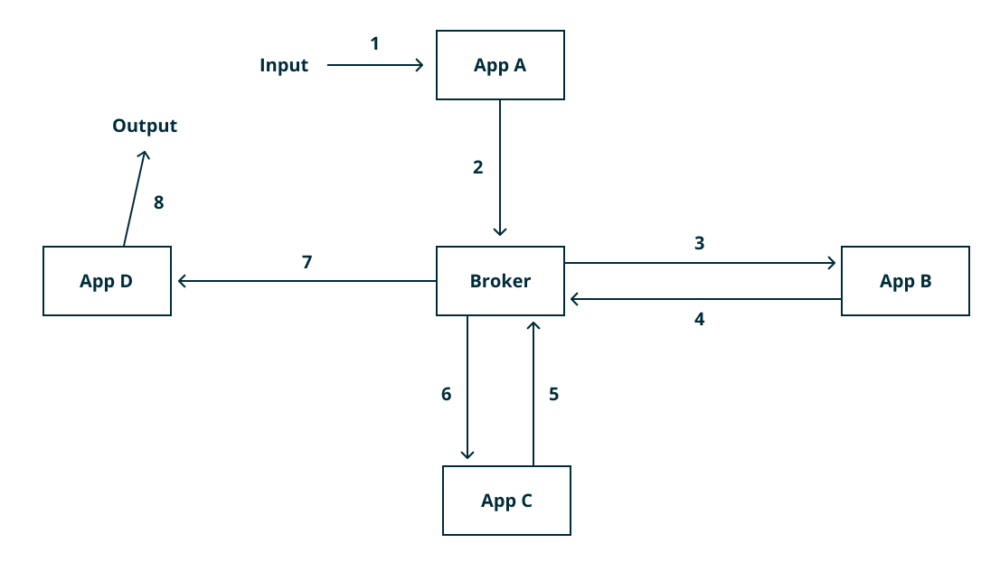

# Comunicación entre los servicios 

***

## Diseño del bus de mensajería (Broker)
En esta arquitectura, toda la comunicación se enruta a través de un grupo de brokers. Los brokers son programas de servidor que ejecutan algunos algoritmos de enrutamiento avanzados.

Cada microservicio se conecta a un broker. El microservicio puede enviar y recibir mensajes a través de la misma conexión. El servicio que envía mensajes se llama editor y el receptor se llama suscriptor. Los mensajes se publican sobre un "tema" en particular. Un suscriptor recibe esos mensajes para los temas a los que se ha suscrito.

El broker utilizado para esta arquitectura es: [RabbitMQ](https://www.rabbitmq.com/)

