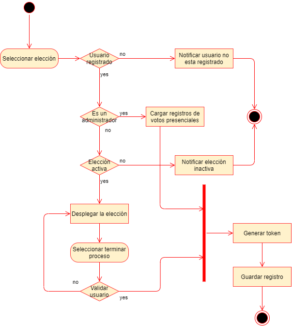

# Diagrama de actividad de emisión de voto

## Descripción
El sistema ***iVoting*** consta de un microservicio que se encarga en la funcionalidad de emisión de voto. Este microservicio nos sirve para llevar el control de las votaciones de los usuarios que estén registrados en el sistema, también de tener la opción de cargar un archivo en donde esta el reporte de los votos realizados de forma presencial.

## Diagrama
A continuación se presenta el diagrama de actividad de emisión de voto.

## Explicación
En el sistema existen dos tipos de usuario, un administrador y los usuarios regulares. El administrador se encarga de cargar los datos de las votaciones que se realizan de forma presencial y los usuarios regulares son los que pueden emitir su voto.

Al momento que un usuario seleccione una elección se debe de validar si el usuario está registrado debido a que el sistema solo permite las votaciones de usuarios registrados, en dado caso el usuario no está registrado se notifica que debe de registrarse para emitir su voto.

Después se valida si el usuario es un usuario administrador o un usuario regular, en dado caso es un usuario administrador se muestra la opción de cargar un archivo que es el reporte de las votaciones de forma presencial, si es un usuario regular se valida si la elección esta activa, cuando la elección no está activa se notifica al usuario que la elección no está disponible, de lo contrario se despliega la vista de votación. Antes que el usuario envié la votación se realiza el proceso de validación de usuario, esto para garantizar seguridad para que otra persona ajena del usuario no pueda realizar su respectivo voto. Luego de validar su usuario se obtiene un token para guardar el registro de votaciones que se realizó.

