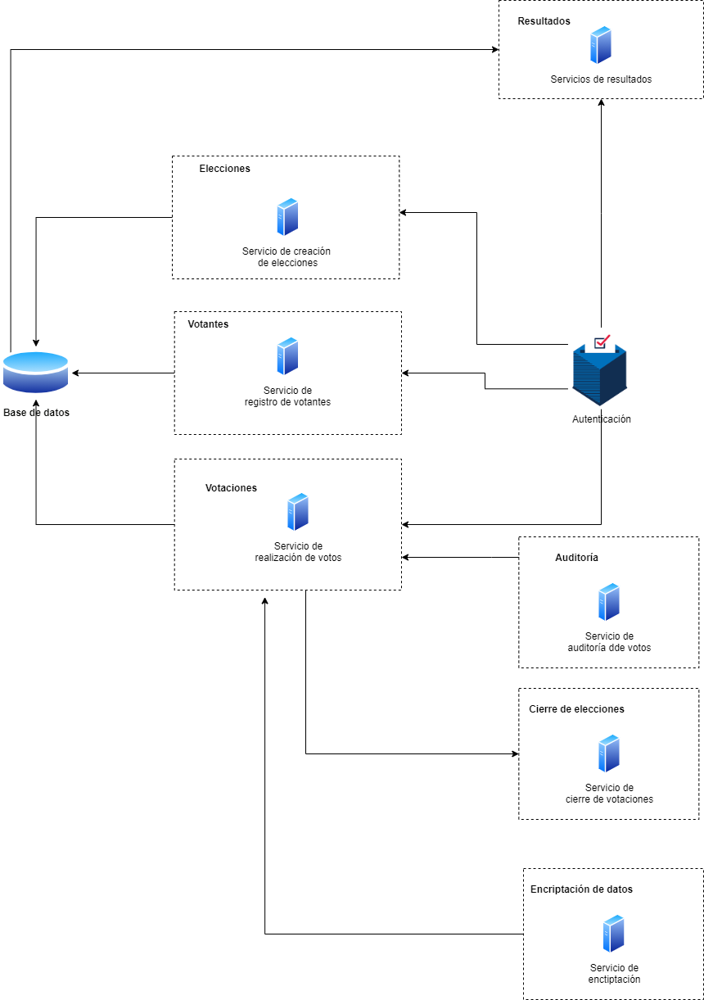

# Diagrama de microservicios

## Descripción
El sistema ***iVoting*** consta de nueve microservicios para realizar las funcionalidades solicitadas.
A continuación se detalla cada uno de ellos

Creación de elecciones: Interfaz gráfica que permite la crear y administrar elecciones, recibe toda la información para que la elección pueda ser generada. La elecciones se almacenan en la base de datos.

Registro de ciudadanos para votar: Permite el ingreso de votantes, solicitando la información completa de la persona. Cada registro es almacenado en la base de datos.

Base de datos: Donde se guardará toda la información utilizada en la aplicación.

Votaciones: Permite la realización de votaciones en las elecciones creadas, solamente pueden acceder las personas que previamente fueron registradas. La información se almacenará en la base de daos.

Resultados: Consulta los resultados almacenados en la base de datos sobre una de las elecciones creadas.

Cierre elecciones: Se comunica con las votaciones ya que le envía al microservicio de Votaciones en que momento deben cerrar las votaciones para poder realizar el conteo de votos.

Auditoria: Microservicio comunicado con el microservicio de votaciones, es el encargado de verificar cantidad de votos y autenticidad de los mismos.

Encriptaicón: Se encarga de encriptar los datos de las votaciones, para garantizar que el voto es secreto y nadie puede acceder a la información.

Autenticación: Toda persona que desea participar en una votación, debe ingresar y validar su usuario por medio de un token.
 

## Diagrama
A continuación se presenta el diagrama de todos los microservicios.

