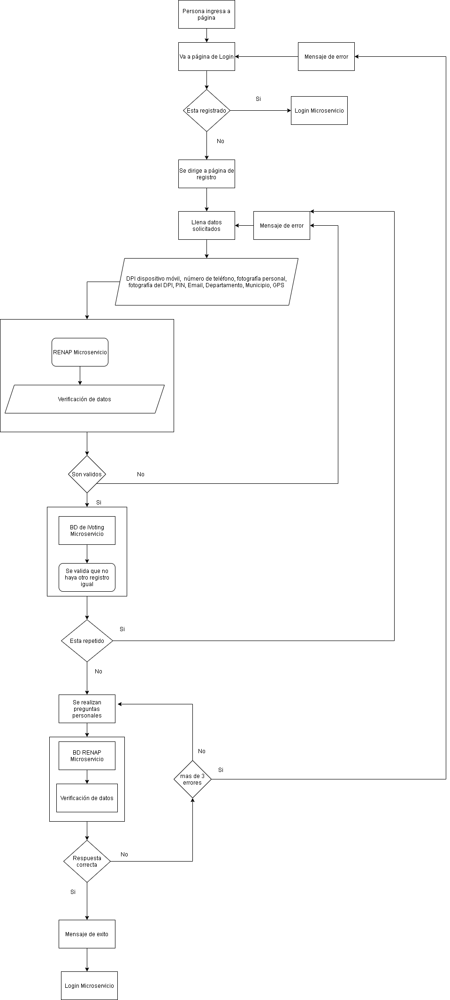

# Proyecto_SA_Grupo2
### Sistema de registro de ciudadanos
Este documento tiene el objetivo de:
<br>
* Dar una explicación breve del diseño de registro de ciudadanos


<br>

Este diseño previo de como se manejara el sistema de registro utiliza ciertas restricciones, que se encuentran a continuación:
<br>

**¿El usuario esta registrado?:**
    
```yaml
*  Si: Proceda a ingresar sus credenciales en el microservicio de Login
* No: Entonces proceda a ir a la página de registro
```

    
**Llene los datos solicitados:**
        
 **¿Son validos? (se verifican con el microservicio de RENAP)**
                
```yaml
* No: Se lanza "Mensa de Error" y se vuelve a pedir que llene los datos
* Si: Se verifica si no esta repetido en la base de datos de iVoting
```

                
 **¿Esta repetido?**
                        
```yaml
* Si: Se lanza "Mensa de Error" y se vuelve a pedir que llene los datos
* No: Se realizan preguntas personales para comprobar si el usuario si es quien dice ser
```

                            
**¿Son correctas?**
                                
```yaml
* Si: Se lanza "Mensaje de Exito" y se procede a pasar a llenar sus credenciales en el microservicio de Login preguntar 
* No: Se vuelve a preguntar hasta que se llegue a un máximo de 3 intentos
```

                                    
**¿Es incorrecta por mas de 3 veces?**
                                        
```yaml
* No: Se lanza "Mensaje de Exito" y se procede a pasar a llenar sus credenciales en el microservicio de Login preguntar 
* Si: Se lanza "Mensa de Error" y se vuelve a pedir que llene los datos
```


