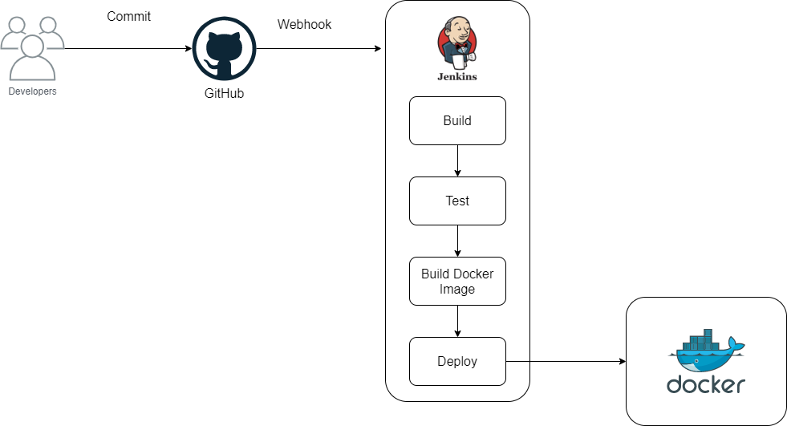

# Pipeline

Un pipeline es una nueva forma de trabajar en el mundo DevOps en la integración continua. Utilizando pipeline se puede definir el ciclo de vida completo de una aplicación.

El pipeline que se estará utilizando se muestra a continuación.

Un desarrollador genera líneas de código para una funcionalidad, al momento de finalizar esta funcionalidad se debe de comprobar si existe posibles errores en el código. Cuando el desarrollador realiza un Commit y sube cambios a la rama principal este activara un evento para que Jenkins empiece a ejecutar cada etapa. Las etapas utilizadas son build, test, build docker y deploy, estas se describirán a continuación.

1. **Stage Build**. En esta etapa se encarga de compilar el código y de instalar dependencias para generar una instancia de la aplicación.

2. **Stage Test**. En esta etapa se ejecutan pruebas para validar el comportamiento de nuestro código, en esta etapa evita errores lleguen a los usuarios finales.

3. **Stage Build Docker**. En esta etapa se encarga de construir las imágenes Docker, etiquetando la imagen y posteriormente agregando a un repositorio de Docker para después utilizarlo al momento de realizar el Deploy.

4. **Stage Deploy**. Una vez construido la imagen se inicia la aplicación a partir de la imagen creada.
