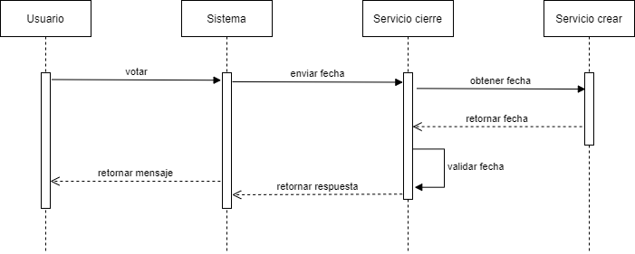

# Proyecto_SA_Grupo2

## Cierre de elecciones

En el sistema ***iVoting*** no es necesario ingresar nuevamente para cerrar las vataciones para una elección sino que cierra la elección automaticamente.

### Diagrama de actividades cierre de elección

Cuando los usuarios eligen una elección para votar, se debe de realizar una validación antes de seguir con el proceso. La validación es la siguiente:

*   Elección activa. El sistema desplegara la pantalla del proceso de votación

*   Elección inactiva. El sistema notificara al usuario si las elecciones fueron cerradas o si aun no ha iniciado.

<table>
<thead>
	<tr>
	    <th>Tipo</th>
		<th>Evento</th>
	</tr>
</thead>
<tbody>
	<tr>
		<td>Exito</td>
		<td>Desplegar pantalla proceso de votación</td>
	</tr>
	<tr>
	    <td>Error</td>
	    <td>Mostrar mensaje "Eleccion inactiva. Puede contactarse con el administrador para volver activar la eleccion"</td>
	</tr>
</tbody>
</table>

### Diagrama de secuencia

