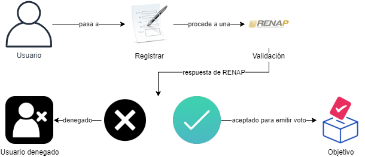
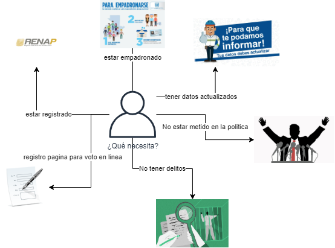
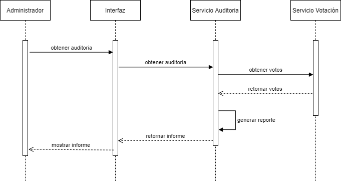

# Votaciones

El módulo de votaciones puede ser accedido solamente por personas previamente registradas. El cual es un microservicio independiente encargado de recibir los votos de las personas en las distintas elecciones que pueden estar creadas así como la información general del voto, es decir, fecha, hora y localidad donde se realizó.

Para asegurar la seguridad del voto y garantizar que el voto es secreto, este microservicio se comunica con el microservicio de encriptación el cual se encarga de esto.

Así mismo se comunica con el microservicio encargado de realizar la auditoría de los votos, para garantizar que todos los votos sean válidos y autenticados correctamente.	

Una parte importante de este servicio es que debe consultar al servicio de cierre de elecciones, para saber si la elección seleccionada por el usuario sigue en estado "Activo".

El servicio ofrece:

	●	Selección entre las opciones disponibles para votar.
	●	Garantizar que se realice solamente un voto por persona.
	●	Guardar los votos en la base de datos
	●	Almacenar los resultados en la base de datos

## Elecciones

Es un proceso electoral en donde una persona emite su voto para elegir a un candidato entre una cantidad de candidatos postulados quienes tomaran un cargo o responsabilidad en un determinado tiempo.

En este proceso es importante garantizar la seguridad de los votos debido a que en este tipo de actividad puede presentarse problemas como el fraude electoral por lo que es necesario poder resolver este tipo de problemas, para resolver esta situación nuestro sistema cuenta con aseguramiento en el voto secreto, único y anónimo. Para tener la seguridad necesaria en nuestro proyecto se hace uso de la tecnología que actualmente tiene cierto punto de control en este tipo de circunstancias, se trata de la tecnología blockchain.

Otra forma de abarcar en la seguridad es en el enrolamiento a nuestro sistema, en esta parte se tomará ciertas consideraciones antes de ser aceptado, debido a que se puede ingresar datos falsificados, por lo tanto, nuestro sistema tendrá comunicación con el sistema encargado del registro nacional de las personas (RENAP) para validar si los datos del usuario sean los valores correctos.

Existen otros factores para que una persona pueda emitir su voto, debe de estar registrado en el RENAP, debe contar con numero de empadronamiento lo que equivale también en actualización de datos, no debe de tener algún delito o que este ligado a un proceso penal y que no debe de ser parte de un partido político.

El voto electrónico es una de las facilidades que se le puede dar a los ciudadanos, debido a que por ciertas razones no acuden a los centros de votaciones para votar, aun con mucha tecnología que hay hoy en día, no todas las personas pueden usarlo, por lo tanto, nuestro sistema abarca la carga de votos de forma presencial, en donde se deja a cargo a una persona para esta tarea, por lo tanto, la organización, empresa u otra entidad debe de estar sujeto a sus leyes para seguir con la seguridad de la misma.

## Auditoria
El proceso de votaciones nos deja registros de las personas que han votado, aquí se realiza un reconteo de todos los votos considerando datos extra de suma importancia para la ayuda de generación de resultados, reportes y otras cosas en las elecciones. Para esto es necesario considerar datos extras de las personas, tales como, fecha, hora, localidad, información de centro de votación como país, departamento o estados, comunidades, centro de votación. Dado este análisis, se considera tomar esa información al momento de que las personas realicen su voto para presentar reportes con más información a la población.

