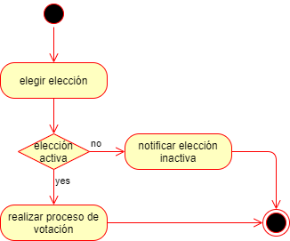

# Proyecto_SA_Grupo2

## Cierre de elecciones

En el sistema ***iVoting*** no es necesario ingresar nuevamente para cerrar las vataciones para una elección sino que cierra la elección automaticamente.

### Diagrama de actividades cierre de elección

Para realizar esta acción se debe de validar si la elección aun sigue activa. En caso que no, se le muestra un cuadro de dialogo al usuario notificando la inactividad de la elección, de lo contrario sigue con el proceso de votación.

<table>
<thead>
	<tr>
		<th>Mensaje</th>
	</tr>
</thead>
<tbody>
	<tr>
		<td>Eleccion inactiva. Puede contactarse con el administrador para volver activar la eleccion.</td>
	</tr>
</tbody>
</table>

### Diagrama de secuencia carga de votaciones presenciales

Esta opción de carga de reporte solamente lo puede realizar el usuario administrador.
El usuario selecciona la opción de cargar un reporte, esta información es llevada al servicio de cierre para realizar el conteo de los votos que fueron realizados de forma presencial y los agrega a la base de datos. El servicio de cierre tiene una comunicación con el servicio de encriptación lo que hace es mantener el voto secreto de cada registro, despues retorna un registro similar solo que de manera anonima. En el momento de haber guardado todo el reporte es enviada al servicio de auditoria para realizar el proceso de registro de informe, el sistema obtendra el informe y lo muestra al usuario.

<table>
<thead>
	<tr>
		<th>Tipo</th>
		<th>Evento</th>
	</tr>
</thead>
<tbody>
	<tr>
	    <td>Exito</td>
		<td>Mostrar mensaje "Registro de votos cargado exitosamente" </td>
	</tr>
	<tr>
	    <td>Exito</td>
		<td>Desplegar informe</td>
	</tr>
	<tr>
	    <td>Error</td>
		<td>Mostrar mensaje "Error interno del servidor"</td>
	</tr>
</tbody>
</table>