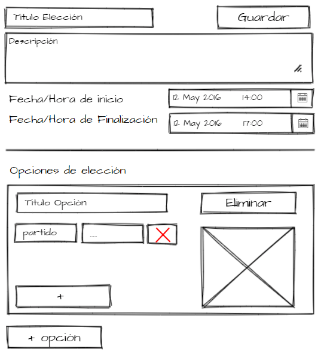

# Proyecto_SA_Grupo2

## Creación de elecciones

Este microservicio nos ayuda para llevar el manejo de la creación de elecciones. Tendrá una interfaz gráfica en donde unicamente puede acceder el administrador, por lo que es necesario que este autenticado. Se piden los siguientes campos para poder realizar este proceso de creación.

<table>
<thead>
	<tr>
		<th>Campo</th>
		<th>Tipo de dato</th>
		<th>Descripción</th>
	</tr>
</thead>
<tbody>
	<tr>
		<td>Titulo de elección</td>
		<td>String</td>
		<td>Es necesario que la elección este identificada para evitar confusiones al momento de querer acceder a la elección.</td>
	</tr>
	<tr>
		<td>Descripción</td>
		<td>String</td>
		<td>Es posible que los usuarios necesiten mas detalle sobre la elección que se esta creando, por lo que se debe dar una breve explicación de que trata.</td>
	</tr>
	<tr>
		<td>Fecha/Hora de inicio</td>
		<td>Date</td>
		<td>Se debe de ingresar una fecha y hora que represente el momento para que los usuarios puedan empezar a realizar sus votaciones.</td>
	</tr>
	<tr>
		<td>Fecha/Hora de fin</td>
		<td>Date</td>
		<td>Se debe de ingresar una fecha y hora que represente el momento para cerrar el proceso de votaciones.</td>
	</tr>
</tbody>
</table>

Además de estos datos se debe de agregar las opciones que pueden elegir los usuarios, en esta parte no se debe de agregar la opción nulo porque por defecto se agrega al crear la elección. Para crear una opción se debe considerar los siguientes campos.

<table>
<thead>
	<tr>
		<th>Campo</th>
		<th>Tipo de dato</th>
		<th>Descripción</th>
	</tr>
</thead>
<tbody>
	<tr>
		<td>Titulo de la opcion</td>
		<td>String</td>
		<td>Se debe de identificar la opción por su nombre</td>
	</tr>
	<tr>
		<td>Imagen</td>
		<td>String</td>
		<td>Se necesita una imagen para mostrar en su elección</td>
	</tr>
</tbody>
</table>

También se debe de ser posible agregar la metadata de una opción por ejemplo:

```
"nombre": "..."
"partido": "..."
"vicepresidente": "..."
...
```

A continuación se presenta un prototipo de como se vera la interfaz grafica para este microservicio.



### Historias de usuario

- COMO administrador QUIERO crear elecciones PARA agilizar el proceso de votacion de forma presencial.

- COMO administrador QUIERO actualizar las elecciones PARA arreglar posibles errores de escritura o para agregar o eliminar opciones.

### Diagrama de secuencia


