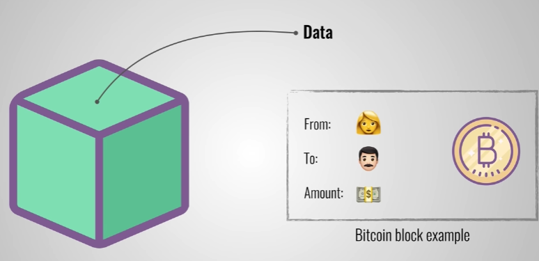
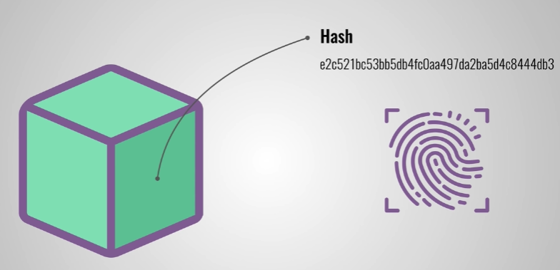
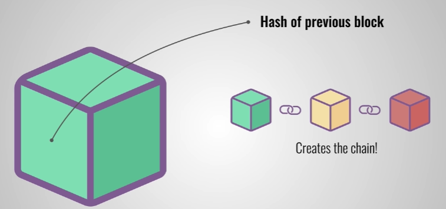
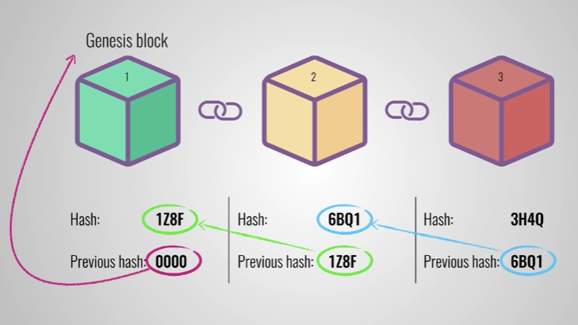
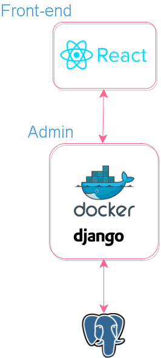

# Proyecto_SA_Grupo2
### Blockchain
Este documento tiene el objetivo de:
 
* Dar una explicación breve de blockchain
* Explicar la tecnología para implementar blockchain

 
Blockchain es una estructura de datos que nacio para manejar especificamente la moneda bitcoin, pero que a lo largo de su existencia se ha encontrado sus usos para otras ocupaciones como auditoría, registros medicos, etc.

La estructura de Blockchain esta compuesta de:
 

* Bloque
* Hashing

 
El bloque esta compuesto por 3 partes:
 

* Data

* Hashing

* Hashing previo

 
El bloque tiene estos atributos ya que el concepto de Blockchain es ser una lista donde cada bloque este conectado por un hashing y cada bloque esta conectado con el hashing del bloque anterior.

El unico bloque que no tiene un hashing previo es el bloque Genesis o el primer bloque.

Para el proyecto que estamos trabajando se nos esta solicitando usar esta estructura de datos para crear un sistema seguro, encriptado, validación y transparencia a la hora de realizar un voto.

Nosotros proponemos utilizar la siguiente tecnología para implementarlo:
 

* Django: para manejar todo lo relacionado al framework donde se estaría manejando el front-end y back-end, además de que Django ya tiene por default una base de datos con SQLlite, pero también se podría usar otro gestor como PostgreSQL.
* Python: Es el lenguaje que usa Django para manejar el back-end.

La arquitectura de este microservicio sería de esta forma:
 

